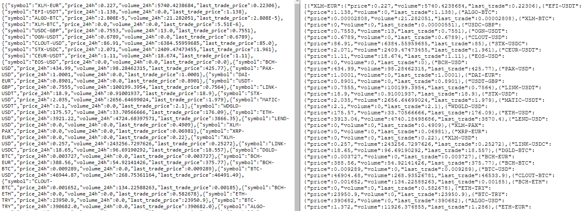
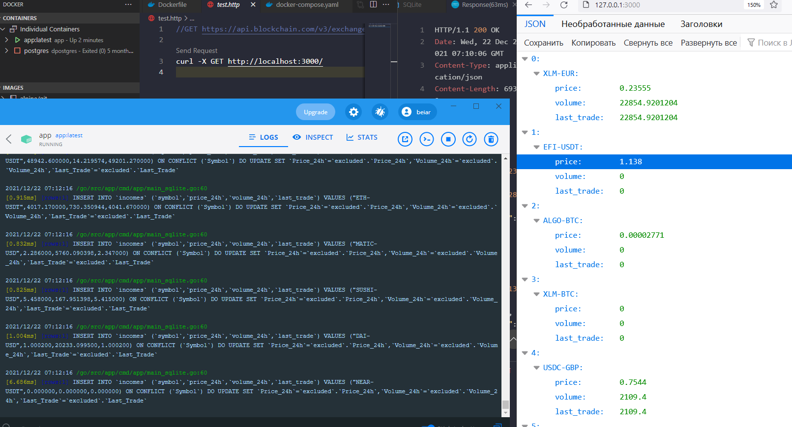

## :scroll: Этапы

### V1.0
- Микросервис на IPv4:3000 порту без базы данных. По запросу возвращает JSON   источника в нужном формате.
- Без тестов и бенчмаринга
- Без Докера и получения данных из среды



``` go run cmd/app/main.go ```

### V2.0

- Микросервис на IPv4:3000 порту c SQLite. Необходимо ограничить запрос к базе при GET запросе в случае отсутствия её обновления
- Без тестов и бенчмаринга
- Без Докера и получения данных из среды

``` go run cmd/app/main_sqlite.go ```


### V2.1

- Успешная сборка Docker контейнера




# Тестовое задание

  

Нужно разработать веб-сервер, который по обращении к нему отдает данные в указанном формате. Данные берутся из внешнего источника и сохраняются в БД раз в 30 секунд, а ответ на запрос должен формироваться на основе данных в БД. В качестве СУБД рекомендуется использовать Postgres, MongoDB, либо SQLite. Опционально рекомендуется сделать конфиг docker-compose, который запускает сервер вместе с сервером базы данных (для встраиваемых СУБД не нужно).

  

## Структура данных

  

Источник: <https://api.blockchain.com/v3/exchange/tickers>

  

На входе будет следущая структура:

  

```js

[{symbol: [string], price_24h: [float64], volume_24h: [float64], last_trade_price: [float64]}...]

```

  

На выходе список должен иметь следующий вид:

  

```js

{<symbol>: {price: <price_24h>, volume: <volume_24h>, last_trade: <last_trade>}...}

```

  

## Пример

  

Входные данные:

  

```json

[

{

"symbol":"XLM-EUR",

"price_24h":0.25685,

"volume_24h":49644.7076291,

"last_trade_price":0.24

}

]

```

  

Выходные данные:

  

```json

{

"XLM-EUR": {

"price": 0.25685,

"volume": 49644.7076291,

"last_trade":0.24

}

}

```

  

## Дополнительно

  

Залить код на гит-репозиторий
